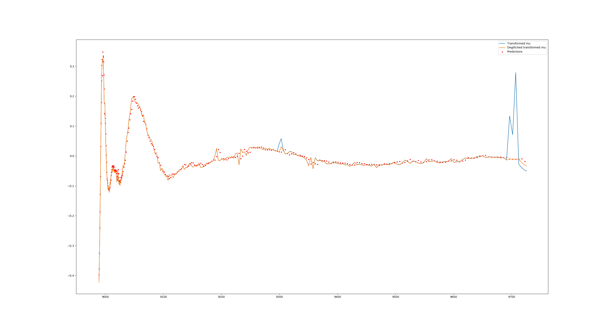

# EXAFS-deglitching

# 1. deglitch_mu.py and lstm_mu.pth

Defines the classes used to deglitch mu and provides an example.  

The deglitching algorithm uses a trained Long Short-Term Memory (LSTM) nerual network to make predictions on successive points in the sequence. If the next measured value is statistically significantly far from the value predicted for it, then that point is labelled as a glitch. The glitchy point is replaced with the predicted value to remove the glitch. If the following point is also determined to be a glitch, then it is determined to be the second point in a step glitch, and the rest of the signal is shifted by the difference between the first predicted point and the corresponding measured value.

The LSTM has a hard time making predictions on mu as it is, so mu is transformed before deglitching by rescaling it to be between zero and one and then subtracting a fitted spline. This has the effect of centering the oscillations around zero, much like chi, and stabilizes the predictions made by the LSTM. The signal is deglitched in this form and then transformed back with the orginal transformation parameters.

### Usage

Define an object with the `Mu_Deglitcher()` class. Use one of `.run()` or `.run_twostage()` with their corresponding arguments and parameters to return the deglitched signal. Inline comments are detailed. Follow the example given.

### Dependencies

Imports LSTMModel from LSTM_on_mu. This is the class that defines the model used for making predictions. When loading the model, deglitch_mu.py uses the file lstm_mu.pth to load all the trained weights and biases. The hyperparamters for the model are defined in the Mu_Deglitcher class and can not be changed for the model to load. 

### Notes

- It is recommended to use `.run_twostage()` because it more robustly detects and fixes glitches, particularly when large step glitches are present.

- `sig_val` is the main tuning parameter. It is essentially a measure of the sensitivity of the algorithm. A higher value of `sig_val` will result in more glitch detections, and a lower value of `sig_val` will result in fewer glitch detections. With clean data, a good next-point predictor, and glitches that show true and sudden statistically significant deviations from the trend, there should exist a range of values of `sig_val` for which only the glitches are identified. I have found `sig_val=0.01` is a conservative value to begin with, and it can be increased for more aggessive glitch detection. Higher than `sig_val=0.025` and the algorithm will likely report false positives.

- The algorithms are designed to remove point and step glitches. Removing point glitches is usually very successful, and false positives are typically inconsequential. False positive step glitches can corrupt the signal more, so it is worth double-checking the necessity when a step glitch is reported. Monochromator glitches involve more than one deviant point and the model is not designed to identify or remove them. However, some initial testing has shown that a monochromator glitch can end up being treated as a combination of point and step glitches and may still be removed entirely. A good indication of a monochromator glitch in the signal is several step glitches being reported in consecutive points. There are also other shapes of glitches that may be present. If they begin with sharp enough changes to trigger the glitch detection algorithm, it is common for the glitch to be smoothed out very well with a series of point and step glitch fixes, shown in the example below, where all changes to the original signal were made by step glitch fixes.
However, a glitch beginning with slow changes will not trigger the glitch detection algortihm and can temporarily disrupt the predictions, as seen in the smaller two-point glitch near 9200. If the glitch ends with a sharp change, it could end up shifting the signal up/down to the glitch, which is not desirable. Again, even with weird shaped glitches, the algorithm will tend to smooth them out with several step and point glitch fixes, but it could do the opposite. So it is always a good idea to verify the success of the algortihm if several glitches are reported in a row.

- The indeces of the detected glitches are not returned and are only printed out if `visualize=True`. It may be desired to have the detected glitch indeces reported every time with the deglitched signal. Let me know.

- Cropping off some initial part of the measured mu is not strictly necessary. The deglitching algorithm runs mostly fine with `crop_ind=0`. However, the sharp increases in energy sampling, the transition to the edge jump, and the pre-edge peaks can all cause false positive identifications of step or point glitches. For best results, crop off the measured points until just after the pre-edge peak. This may be earlier than the E_0 used to transform mu to chi, but it may end up being convenient to just use E_0 as the cropping point. In a future version, the choice of cropping point may be automated.

- The machine learning algorithm is trained on an energy sampling rate that gives the most consistently accurate predictions on the data I used for testing. The algorithm works decently with varying sampling rates, but in areas with strong oscillations, the next point predictions can drift from the real data in different ways. If the measured data contains a higher sampling rate than what the model was trained on, then the model will tend to make predictions that are closer to zero than the real data. My guess is that this is because the model expects each oscillation to take a fewer number of points, so it guesses that the signal should be returning to zero sooner than it is. If the measured data contains lower sampling rates than what the model was trained on, then the predictions will tend to lag behind the real data because the model is accustomed to guessing smaller changes between points. The result is that poor predictions can cause less consistent glitch detection and less effective glitch fixing.
The changing sampling rates are not too problematic for the data used for testing, but for robust implementation, something in a future verion should account for the different sampling rates. 

- The hyperparameters for training and the current set of default glitch detection parameters have all been (possibly over-) tuned to work best for the limited set of real world testing data I had access to. This may have resulted in overfitting and results may be worse for different datasets. More testing will be done on more data as soon as possible. 

- Effect of high noise: High noise can give false positives. This can be remedied by training with higher noise, but sacrifices some prediction accuracy for signals with low noise. I will work on this problem.

# 2. LSTM_on_mu.py

When run, this file trains and tests a new LSTM model for next point prediction and saves it as lstm_mu.pth. For operating the deglitcher, this file is only useful for the `LSTMModel()` class it contains, which defines the structure of the LSTM model that is used for loading the trained model into deglitch_mu.py.

# 3. deglitch_mu_w_chi_transform.py, LSTM_on_chi1.py, and lstm_chi1.pth

These files function identically to deglitch_mu.py, LSTM_on_mu.py, and lstm_mu.pth, but uses a complete transformation of mu to chi before making predictions with the LSTM. deglitch_mu.py almost transforms to chi anyway, but has a few fewer restrictions. One of them being that the cropping point can be earlier than E_0.

# 4. discriminate_pixels.py

Defines functions that take a set of fluorescence scans from the independent detectors (pixels) and sort out the ones without useful signal. Running the script runs a random example on sets of real data.

First, for each signal in the set of measurements, the list of differences between consecutive points is extracted. Then the mean and standard deviation for each list of consecutive differences is calculated. By using the mean and standard deviation of the consecutive differences, each signal is reduced to a two-dimensional space. It was found that this method of dimensionality reduction resolves the useful scans into an isolated cluster. DBSCAN is used to find the cluster of scans that are all most similar to each other and reject the outliers. The functions in this file return the indeces of the pixel scans that belong to the (or a) cluster.

### Usage

Run the function `find_good_pix()` on a set of pixel scans. The inline comments are detailed. Follow the example. There are options for visualizing the process and the results.

### Notes

-The default parameters work fine for the data I have used for testing. min_samples should be kept above three, as there are usually three pixels that are zero or contain nans and they could be identified as a cluster together. If min_samples is too high, it may be that no cluster is identified. eps is the main tuning parameter. The higher eps is, the more points will be included in a cluster. The lower it is, the fewer points will be clustered, and the smaller clusters will be. Sometimes with a low eps, more than one cluster may be identified. This may be desirable if there are two meaningfully different types of scans. 

In the dataset I have been using for testing, one pixel scan always contains a full list of nans. During pixel normalization, if a scan contains a nan, it is set to zeros. In every case I have tested, the zeroed scans are never part of the main cluster, but that might not always be true. In which case, you may end up trying to do analysis with nan values. This may be fixed in a future verion where the labels for the zero and nan scans are set to -1 from the outset. 

A future version may be made where the tuning of eps is interactive and the script displays the clustering plot for different values of eps.
